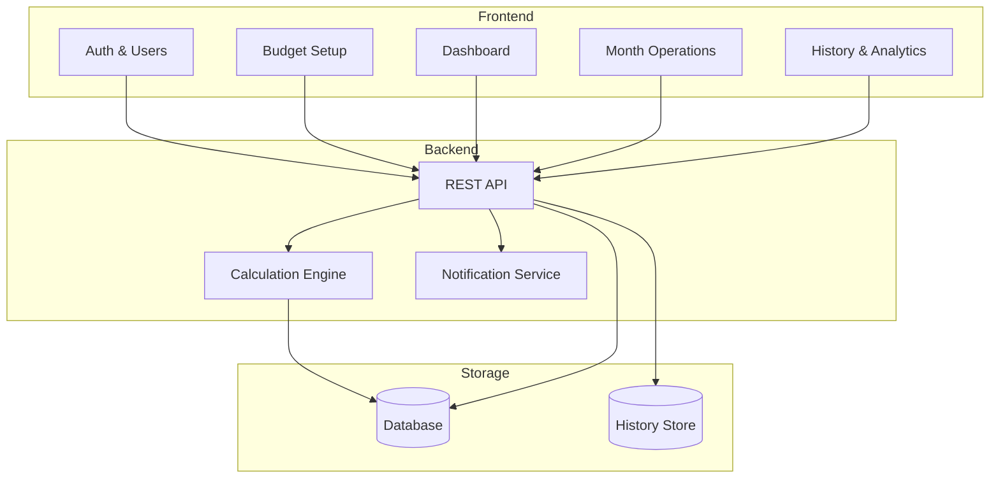
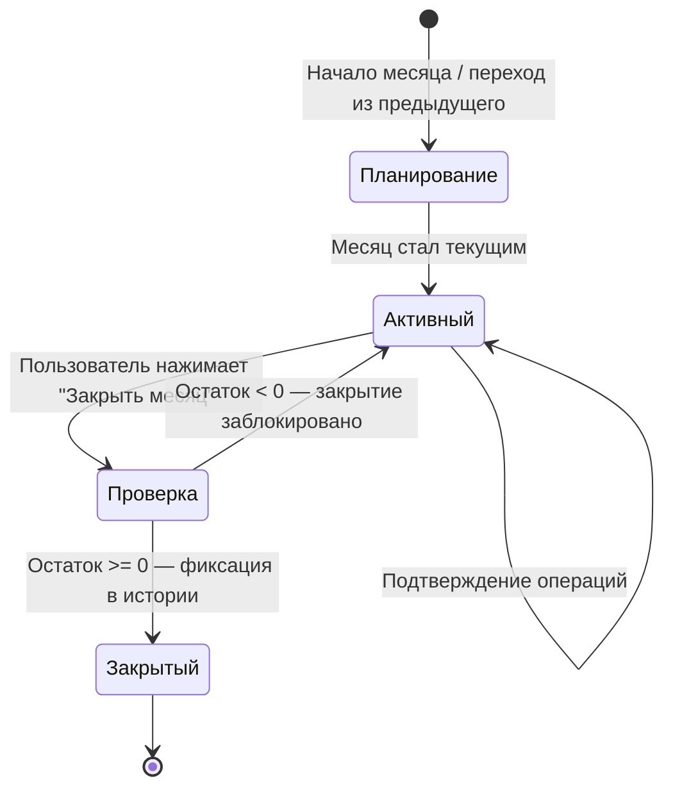
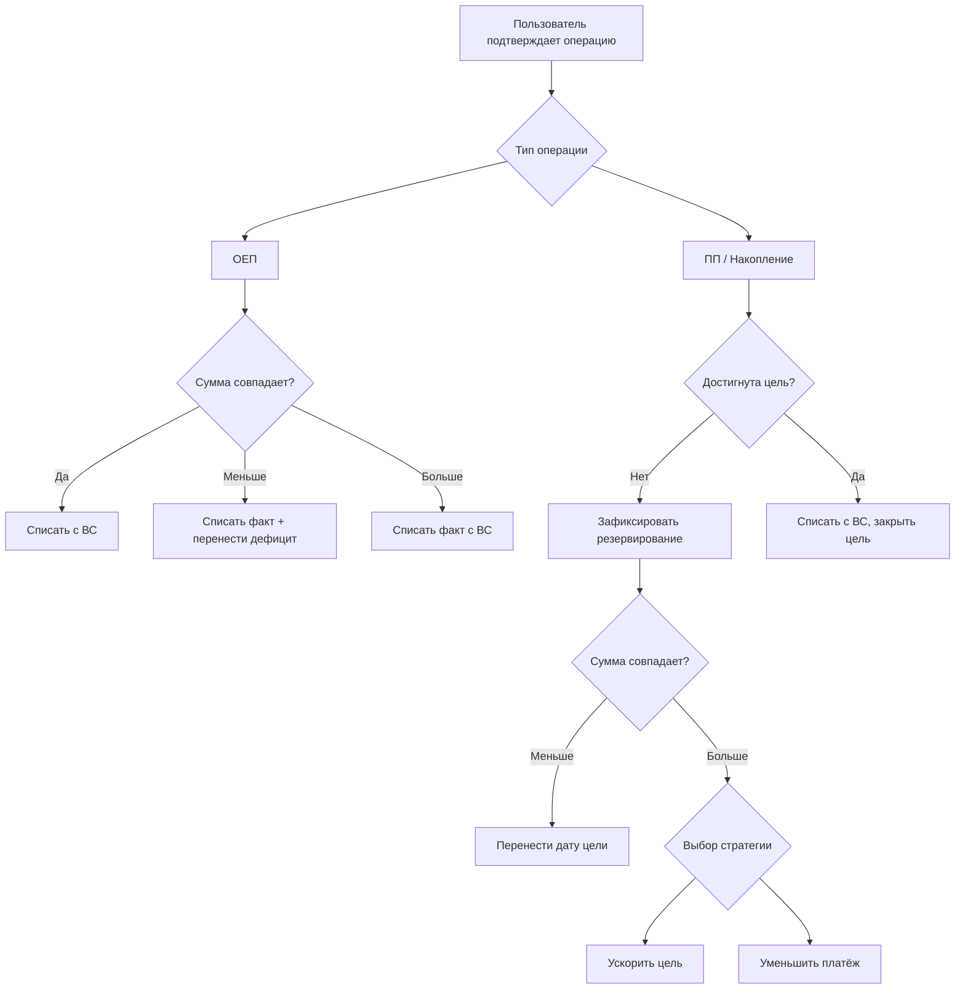

# Анализ концепции: «Семейный финансовый планировщик "Резерв"»

---

## 1. Выявленные пробелы и противоречия

### 1.1 Онбординг и начальный баланс
**Проблема:** Нигде не описано, как пользователь вводит стартовое состояние системы.

**Необходимо добавить:**
- Ввод начального баланса Виртуального счёта при первом запуске
- Выбор стартового месяца (с какого месяца начинается планирование)
- Возможность импорта текущих обязательств (ОЕП, ПП), которые уже существуют

---

### 1.2 Многопользовательский режим — не проработан
**Проблема:** Раздел 2.5 очень краткий, а совместная работа порождает серьёзные сценарии:

| Сценарий | Статус в ТЗ |
|----------|-------------|
| Два пользователя одновременно подтверждают операции | ❌ Не описан |
| Один пользователь редактирует ОЕП, другой закрывает месяц | ❌ Не описан |
| Уведомления о действиях других участников | ❌ Не описан |
| Что происходит с бюджетом при выходе пользователя | ❌ Не описан |

---

### 1.3 Уведомления — упомянуты, но не описаны
В п. 5.3 есть фраза «Уведомления об изменениях в планах», но:
- Канал доставки не указан (email, push, in-app?)
- Перечень триггерных событий отсутствует
- Нет разграничения: какие уведомления обязательные, какие настраиваемые

---

### 1.4 Накопление «Как можно скорее» — логическая проблема
**Проблема:** Алгоритм фиксирует платёж равным текущему свободному остатку **в момент создания**. Но свободный остаток меняется каждый месяц.

**Вопросы:**
- Пересчитывается ли платёж, если свободный остаток изменился?
- Что происходит, если появился новый ОЕП и свободный остаток стал меньше зафиксированного платежа?

---

### 1.5 Закрытие месяца — неполный алгоритм
Описан порядок действий, но не указано:
- Все ли операции должны быть подтверждены/отменены перед закрытием, или допускаются неподтверждённые?
- Если допускаются — как они обрабатываются (автоматическая отмена или перенос)?
- Что является «активным месяцем» до первого закрытия?

---

### 1.6 Технический стек — полностью отсутствует
ТЗ не содержит никаких технических требований к платформе:
- Фронтенд-фреймворк
- Бэкенд и язык
- База данных
- Среда развёртывания (хостинг)
- Резервное копирование

---

### 1.7 Мобильная и адаптивная версия
Не указаны требования к адаптивности интерфейса. Для семейного приложения это критично.

---

## 2. Структура функциональных требований (доработанная)

Предлагаю переструктурировать раздел 2 по принципу **«что делает пользователь»**, а не «что хранит система»:

```
FR-01  Регистрация и доступ
FR-02  Первоначальная настройка (онбординг)
FR-03  Управление доходами
FR-04  Управление расходами (ОЕП)
FR-05  Управление плановыми платежами (ПП)
FR-06  Управление накоплениями
FR-07  Дашборд и текущий бюджет
FR-08  Подтверждение операций
FR-09  Закрытие месяца
FR-10  История и аналитика
FR-11  Уведомления
FR-12  Многопользовательский режим
```

Нумерация позволит однозначно ссылаться на требования при разработке и тестировании.

---

## 3. Логические модули системы

### Модуль 1 — Auth & Users (Аутентификация и пользователи)
**Назначение:** Управление доступом и ролями.

**Функции:**
- Создание пользователей (только разработчик)
- Вход / выход / восстановление пароля
- Управление ролями: Владелец / Участник
- Приглашение участников по email
- Удаление пользователей и бюджетов (только Владелец)

**Связи:** → все остальные модули (авторизация)

---

### Модуль 2 — Budget Setup (Настройка бюджета)
**Назначение:** Первоначальный и текущий ввод параметров бюджета.

**Функции:**
- Ввод начального баланса Виртуального счёта
- Выбор стартового месяца
- Настройка основного дохода (бессрочный / временный)
- Создание и редактирование статей ОЕП, ПП, Накоплений

**Связи:** → Calculation Engine, Dashboard

---

### Модуль 3 — Calculation Engine (Расчётный движок)
**Назначение:** Центральный модуль всех финансовых расчётов. Не имеет UI — только бизнес-логика.

**Функции:**
- Расчёт Виртуального счёта (алг. 3.3)
- Расчёт Зарезервированных средств (алг. 3.4)
- Расчёт Свободного остатка (алг. 3.5)
- Расчёт ежемесячных платежей по ПП и Накоплениям
- Обработка отклонений от плана (алг. 3.6)
- Пересчёт прогнозных бюджетов будущих месяцев

**Связи:** ← Budget Setup, ← Month Operations; → Dashboard, → History

---

### Модуль 4 — Dashboard (Дашборд)
**Назначение:** Основной экран с актуальным состоянием бюджета.

**Функции:**
- Отображение Виртуального счёта, Резерва, Свободного остатка
- Список доходов и расходов текущего месяца (план vs факт)
- Прогноз на будущие месяцы
- Быстрое добавление разовых доходов/расходов

**Связи:** ← Calculation Engine; → Month Operations

---

### Модуль 5 — Month Operations (Операции месяца)
**Назначение:** Управление жизненным циклом текущего месяца.

**Функции:**
- Подтверждение операции (ОЕП, ПП, Накопление) — стандартное и с изменением суммы
- Отмена операции
- Добавление незапланированных доходов/расходов
- Распределение свободного остатка (списать / перенести)
- Закрытие месяца (с валидацией отсутствия отрицательного остатка)

**Связи:** ← Dashboard; → Calculation Engine, → History

---

### Модуль 6 — History & Analytics (История и аналитика)
**Назначение:** Хранение и отображение закрытых месяцев и лога действий.

**Функции:**
- Хранение снимков закрытых месяцев (read-only)
- Лог всех действий пользователей (кто, что, когда)
- Сравнение план/факт за закрытые периоды
- *(опционально)* Графики динамики Виртуального счёта и Свободного остатка

**Связи:** ← Month Operations; → Dashboard (историческая справка)

---

### Модуль 7 — Notifications (Уведомления)
**Назначение:** Информирование пользователей о событиях в системе.

**Функции:**
- Напоминания о приближающихся платежах
- Уведомления о действиях других участников бюджета
- Предупреждения о риске отрицательного остатка
- Уведомления об изменении дат целей при недовнесении

**Связи:** ← Calculation Engine, ← Month Operations; → User (email / in-app)

---

## 4. Архитектурная схема (Mermaid)

### 4.1 Модульная архитектура



---

### 4.2 Жизненный цикл месяца



---

### 4.3 Алгоритм подтверждения операции



---

## 5. Сводная таблица: пробелы и приоритеты

| # | Пробел | Приоритет | Рекомендация |
|---|--------|-----------|--------------|
| 1 | Онбординг / начальный баланс | 🔴 Критично | Добавить раздел FR-02 |
| 2 | Накопление «Как можно скорее» — пересчёт | 🔴 Критично | Уточнить алгоритм 3.6 |
| 3 | Закрытие месяца с неподтверждёнными операциями | 🔴 Критично | Уточнить алгоритм закрытия |
| 4 | Конкурентный доступ (два пользователя) | 🟠 Важно | Добавить в FR-12 |
| 5 | Уведомления | 🟠 Важно | Добавить раздел FR-11 |
| 6 | Технический стек | 🟠 Важно | Добавить раздел 6 в ТЗ |
| 7 | Адаптивная/мобильная версия | 🟡 Желательно | Добавить в раздел 4 |
| 8 | Резервное копирование данных | 🟡 Желательно | Добавить в раздел 4 |

---

## 6. Следующие шаги

1. **Уточнить пробелы** (п. 5) — ответить на открытые вопросы по алгоритмам
2. **Выбрать технический стек** — это повлияет на структуру БД и архитектуру
3. **Разработать схему базы данных** — модели сущностей и связи
4. **Детализировать FR** — написать user stories или use cases для каждого требования
5. **Обновить файл concept.md** в репозитории с учётом правок
