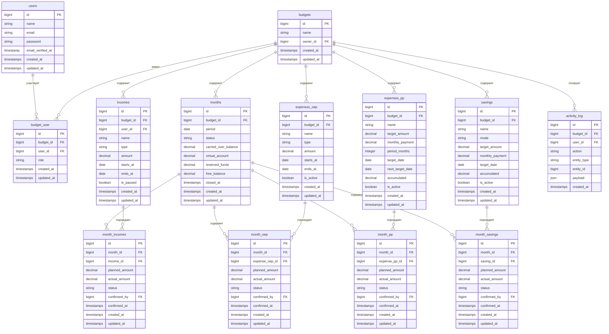

# Схема базы данных
## Семейный финансовый планировщик «Резерв»

**Стек:** Laravel 11 + MySQL 8  
**Версия:** 1.0  
**Дата:** ___________

---

## Содержание

1. [Диаграмма сущностей (ERD)](#1-диаграмма-сущностей-erd)
2. [Описание таблиц](#2-описание-таблиц)
3. [Связи между таблицами](#3-связи-между-таблицами)
4. [Индексы и производительность](#4-индексы-и-производительность)

---

## 1. Диаграмма сущностей (ERD)



---

## 2. Описание таблиц

### `users` — Пользователи

| Колонка | Тип | Описание |
|---|---|---|
| `id` | bigint PK | Автоинкремент |
| `name` | varchar(255) | Имя пользователя |
| `email` | varchar(255) UNIQUE | Email для входа |
| `password` | varchar(255) | Хэш bcrypt |
| `email_verified_at` | timestamp NULL | Дата верификации |
| `created_at` | timestamp | — |
| `updated_at` | timestamp | — |

---

### `budgets` — Бюджеты

| Колонка | Тип | Описание |
|---|---|---|
| `id` | bigint PK | Автоинкремент |
| `name` | varchar(255) | Название бюджета |
| `owner_id` | bigint FK → users | Владелец бюджета |
| `created_at` | timestamp | — |
| `updated_at` | timestamp | — |

---

### `budget_user` — Участники бюджета (pivot)

| Колонка | Тип | Описание |
|---|---|---|
| `id` | bigint PK | — |
| `budget_id` | bigint FK → budgets | — |
| `user_id` | bigint FK → users | — |
| `role` | enum('owner','member') | Роль в бюджете |
| `created_at` | timestamp | Дата добавления |
| `updated_at` | timestamp | — |

---

### `months` — Месяцы бюджета

Каждая строка — один календарный месяц одного бюджета.

| Колонка | Тип | Описание |
|---|---|---|
| `id` | bigint PK | — |
| `budget_id` | bigint FK → budgets | — |
| `period` | date | Первый день месяца (2025-03-01) |
| `status` | enum('active','closed') | Статус месяца |
| `carried_over_balance` | decimal(15,2) | Перенесённый СО из предыдущего месяца |
| `virtual_account` | decimal(15,2) | Виртуальный счёт (пересчитывается) |
| `reserved_funds` | decimal(15,2) | Зарезервированные средства |
| `free_balance` | decimal(15,2) | Свободный остаток (ВС − Резерв) |
| `closed_at` | timestamp NULL | Дата закрытия месяца |
| `created_at` | timestamp | — |
| `updated_at` | timestamp | — |

> **Уникальный индекс:** `(budget_id, period)` — один месяц на бюджет.

---

### `incomes` — Статьи доходов (шаблоны)

| Колонка | Тип | Описание |
|---|---|---|
| `id` | bigint PK | — |
| `budget_id` | bigint FK → budgets | — |
| `user_id` | bigint FK → users | Чей доход |
| `name` | varchar(255) | Название («Зарплата») |
| `type` | enum('permanent','temporary','one_time') | Тип дохода |
| `amount` | decimal(15,2) | Сумма |
| `starts_at` | date NULL | Начало периода (для temporary) |
| `ends_at` | date NULL | Конец периода (для temporary) |
| `is_paused` | boolean | Приостановлен |
| `created_at` | timestamp | — |
| `updated_at` | timestamp | — |

---

### `month_incomes` — Доходы в разрезе месяца (факт)

| Колонка | Тип | Описание |
|---|---|---|
| `id` | bigint PK | — |
| `month_id` | bigint FK → months | — |
| `income_id` | bigint FK → incomes NULL | NULL для разовых без шаблона |
| `planned_amount` | decimal(15,2) | Плановая сумма |
| `actual_amount` | decimal(15,2) NULL | Фактическая сумма после подтверждения |
| `status` | enum('planned','confirmed') | Статус дохода |
| `confirmed_by` | bigint FK → users NULL | Кто подтвердил |
| `confirmed_at` | timestamp NULL | Когда подтверждено |
| `created_at` | timestamp | — |
| `updated_at` | timestamp | — |

---

### `expenses_oep` — Статьи ОЕП (шаблоны)

| Колонка | Тип | Описание |
|---|---|---|
| `id` | bigint PK | — |
| `budget_id` | bigint FK → budgets | — |
| `name` | varchar(255) | Название («Аренда») |
| `type` | enum('permanent','temporary') | Тип |
| `amount` | decimal(15,2) | Плановая сумма |
| `starts_at` | date NULL | Начало периода |
| `ends_at` | date NULL | Конец периода |
| `is_active` | boolean | Активна ли статья |
| `created_at` | timestamp | — |
| `updated_at` | timestamp | — |

---

### `month_oep` — ОЕП в разрезе месяца (факт)

| Колонка | Тип | Описание |
|---|---|---|
| `id` | bigint PK | — |
| `month_id` | bigint FK → months | — |
| `expense_oep_id` | bigint FK → expenses_oep | — |
| `planned_amount` | decimal(15,2) | Плановая сумма |
| `actual_amount` | decimal(15,2) NULL | Фактическая сумма |
| `status` | enum('planned','written_off','cancelled') | Статус платежа |
| `confirmed_by` | bigint FK → users NULL | Кто подтвердил |
| `confirmed_at` | timestamp NULL | Когда |
| `created_at` | timestamp | — |
| `updated_at` | timestamp | — |

---

### `expenses_pp` — Статьи ПП (шаблоны)

| Колонка | Тип | Описание |
|---|---|---|
| `id` | bigint PK | — |
| `budget_id` | bigint FK → budgets | — |
| `name` | varchar(255) | Название («ОСАГО») |
| `target_amount` | decimal(15,2) | Целевая сумма |
| `monthly_payment` | decimal(15,2) | Ежемесячный взнос (target ÷ period) |
| `period_months` | int | Периодичность в месяцах |
| `target_date` | date | Текущая дата целевого платежа |
| `next_target_date` | date NULL | Следующая дата (после списания цели) |
| `accumulated` | decimal(15,2) | Уже накоплено |
| `is_active` | boolean | Активна |
| `created_at` | timestamp | — |
| `updated_at` | timestamp | — |

---

### `month_pp` — ПП в разрезе месяца (факт)

| Колонка | Тип | Описание |
|---|---|---|
| `id` | bigint PK | — |
| `month_id` | bigint FK → months | — |
| `expense_pp_id` | bigint FK → expenses_pp | — |
| `planned_amount` | decimal(15,2) | Плановый взнос |
| `actual_amount` | decimal(15,2) NULL | Фактический взнос |
| `status` | enum('planned','written_off','cancelled') | Статус |
| `confirmed_by` | bigint FK → users NULL | Кто подтвердил |
| `confirmed_at` | timestamp NULL | Когда |
| `created_at` | timestamp | — |
| `updated_at` | timestamp | — |

---

### `savings` — Статьи накоплений (шаблоны)

| Колонка | Тип | Описание |
|---|---|---|
| `id` | bigint PK | — |
| `budget_id` | bigint FK → budgets | — |
| `name` | varchar(255) | Название («На отпуск») |
| `mode` | enum('asap','by_date','no_goal') | Режим накопления |
| `target_amount` | decimal(15,2) NULL | Целевая сумма (NULL для no_goal) |
| `monthly_payment` | decimal(15,2) | Ежемесячный взнос |
| `target_date` | date NULL | Целевая дата (для by_date и asap) |
| `accumulated` | decimal(15,2) | Уже накоплено |
| `is_active` | boolean | Активно |
| `created_at` | timestamp | — |
| `updated_at` | timestamp | — |

---

### `month_savings` — Накопления в разрезе месяца (факт)

| Колонка | Тип | Описание |
|---|---|---|
| `id` | bigint PK | — |
| `month_id` | bigint FK → months | — |
| `saving_id` | bigint FK → savings | — |
| `planned_amount` | decimal(15,2) | Плановый взнос |
| `actual_amount` | decimal(15,2) NULL | Фактический взнос |
| `status` | enum('planned','reserved','written_off','cancelled') | Статус |
| `confirmed_by` | bigint FK → users NULL | Кто подтвердил |
| `confirmed_at` | timestamp NULL | Когда |
| `created_at` | timestamp | — |
| `updated_at` | timestamp | — |

> **Статусы накоплений:**
> - `planned` — запланирован
> - `reserved` — взнос подтверждён, деньги зарезервированы (не списаны с ВС)
> - `written_off` — цель достигнута, нажата кнопка «Потратить», деньги списаны с ВС
> - `cancelled` — платёж отменён

---

### `activity_log` — Лог действий

| Колонка | Тип | Описание |
|---|---|---|
| `id` | bigint PK | — |
| `budget_id` | bigint FK → budgets | — |
| `user_id` | bigint FK → users | Кто совершил действие |
| `action` | varchar(100) | Тип действия (create, update, confirm, cancel, close_month…) |
| `entity_type` | varchar(100) | Сущность (month_oep, saving, income…) |
| `entity_id` | bigint | ID затронутой записи |
| `payload` | json NULL | Было/стало (old_value, new_value) |
| `created_at` | timestamp | Когда |

---

## 3. Связи между таблицами

```
users ──< budget_user >── budgets
                              │
                    ┌─────────┼──────────┬───────────┬───────────┐
                    │         │          │           │           │
                  months   incomes  expenses_oep  expenses_pp  savings
                    │         │          │           │           │
             ┌──────┤    month_incomes  month_oep  month_pp  month_savings
             │      │
          activity_log
```

**Ключевой паттерн — «шаблон + факт»:**

Каждая финансовая сущность состоит из двух уровней:
- **Шаблон** (`incomes`, `expenses_oep`, `expenses_pp`, `savings`) — настройки статьи, не привязаны к конкретному месяцу
- **Факт** (`month_incomes`, `month_oep`, `month_pp`, `month_savings`) — конкретный платёж в конкретном месяце со статусом и фактической суммой

При создании нового месяца система автоматически генерирует записи-факты для всех активных шаблонов.

---

## 4. Индексы и производительность

```sql
-- Быстрый поиск месяца бюджета
CREATE UNIQUE INDEX idx_months_budget_period ON months(budget_id, period);

-- Быстрая выборка активных шаблонов бюджета
CREATE INDEX idx_incomes_budget ON incomes(budget_id, is_paused);
CREATE INDEX idx_expenses_oep_budget ON expenses_oep(budget_id, is_active);
CREATE INDEX idx_expenses_pp_budget ON expenses_pp(budget_id, is_active);
CREATE INDEX idx_savings_budget ON savings(budget_id, is_active);

-- Быстрая выборка платежей месяца
CREATE INDEX idx_month_oep_month ON month_oep(month_id);
CREATE INDEX idx_month_pp_month ON month_pp(month_id);
CREATE INDEX idx_month_savings_month ON month_savings(month_id);
CREATE INDEX idx_month_incomes_month ON month_incomes(month_id);

-- Лог: последние 50 действий бюджета
CREATE INDEX idx_activity_log_budget ON activity_log(budget_id, created_at DESC);
```

---

## 5. Важные бизнес-правила на уровне БД

1. **`months.virtual_account`** — пересчитывается при каждом подтверждении операции, не хранится как единственная истина (вычисляется из транзакций)
2. **`months.status = 'closed'`** — после закрытия записи `month_*` не могут быть изменены (enforce на уровне API)
3. **`savings.status = 'reserved'`** — деньги физически на счету, но `months.reserved_funds` увеличен
4. **Каскадное удаление** — удаление бюджета удаляет все связанные данные (`ON DELETE CASCADE`)
5. **`activity_log`** — только INSERT, никогда UPDATE или DELETE — неизменяемый аудит
